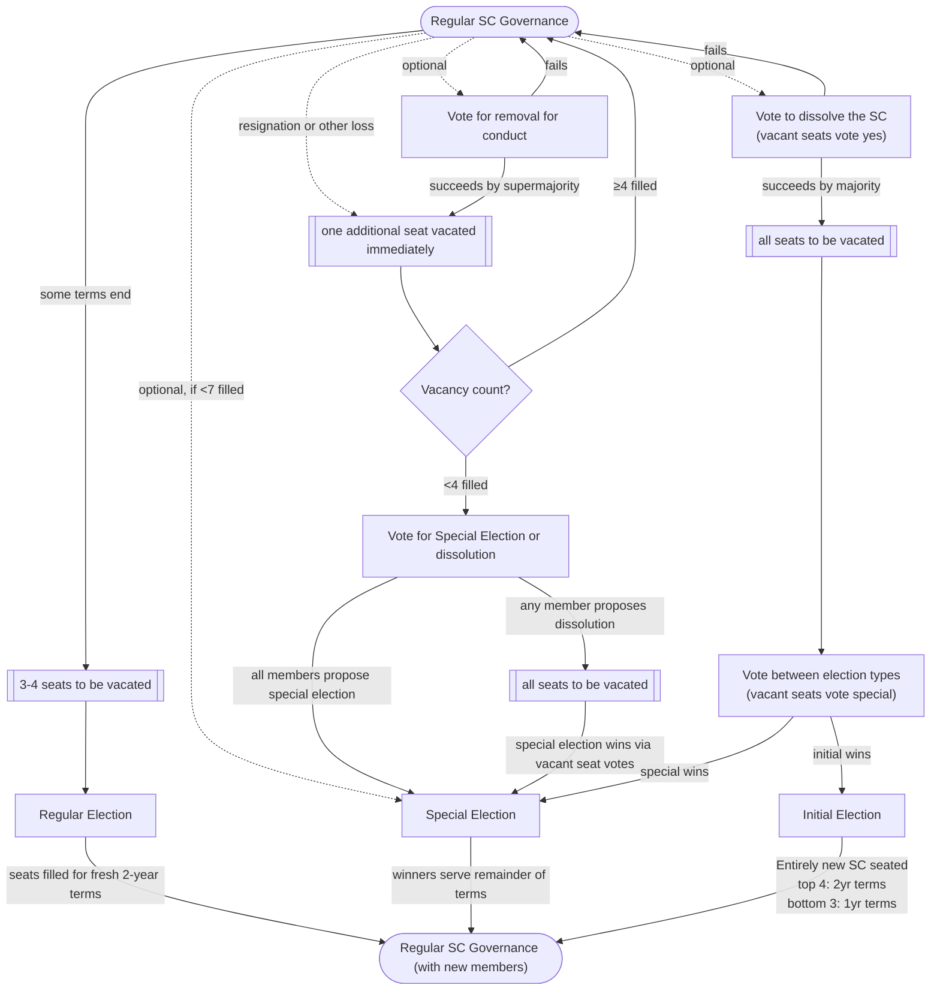

# Constitution Commentary

This document contains a non-normative, non-binding commentary on the constitution, explaining some subtleties.

## SC Election and Removal procedure

The state machine of the portions of the constitution that govern the composition of the SC (what seats are filled, who is in which seat) is especially complex.
The following flow chart diagrams this state machine:

### Deferred versus immediate loss of members

A no-confidence vote does not immediately dissolve the SC.
It just triggers the election (which presumably cannot be cancelled) at which point all current SC members loose their seats (unless reelected).
By contrast, removal for conduct does immediately remove an SC member.

Voluntary resignations are a grey area.
In the above diagram they are also diagrammed as immediately taking effect, but arguably they could also be deferred until the election when those seats are replaced.

The important part of this distinction is who is a member voting in subsequent votes.
Members removed for conduct do not vote choose the election type (in the no-confidence case) or whether to hold a special election (in the seats-vacated case).
Members not resigning absolutely do vote in both those cases.
Voluntarily-resigning members are a grey area.

### When the SC drops before 4 members

The most subtle part is what happens when the SC drops below 4 members due to "resignation or other less" or removal for conduct.

The constitution states that when less than half of the seats are filled, a special election must occur.
But, presumably, a vote of no-confidence, triggering a full reelection can occur at any time.
Therefore, that can also occur instead at this point, leading indeed to a special election also, but a different sort of special election.

If any SC member proposes a no-confidence vote, the vote will automatically win due to how vacant seats are counted for such votes.
The vacant seats will also automatically cause special election, rather than initial election, to win the subsequent vote for the type of full reelection.
However, vacant seats do not trigger votes, they only vote once a sitting member triggers a vote.
Therefore at this point, no attempt to hold a no confidence vote will end in a special election of just the currently-vacant seats, while any attempt to hold a no-confidence vote will end in a special election for all seats.

Note that both paths above lead to a special election.
As a corollary, it is only possible to follow no-confidence with an initial election when more than half of the SC seats were full prior to the no-confidence vote.
