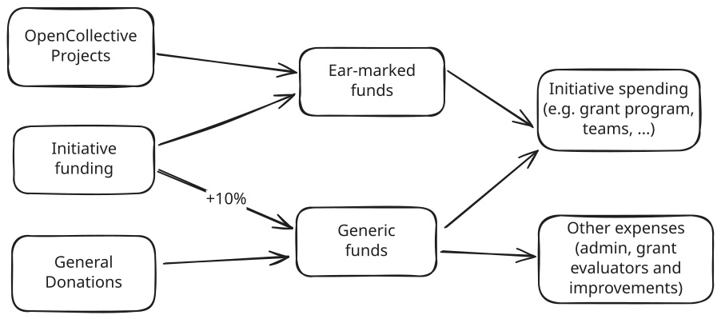
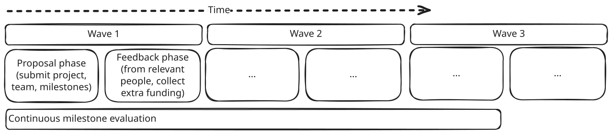
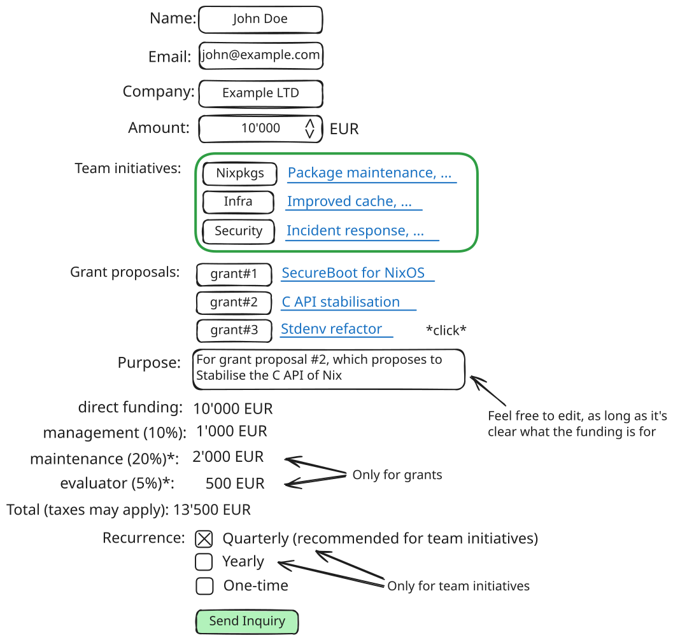

# Proposal: Grant program and initiative funding

Alternative title: Filling funding flow gaps

## Motivation

- Use NixOS Foundation donations for beneficial purposes in a more transparent way
- Enable companies to finance Nix ecosystem improvements in a more streamlined way
- Enable contributors to get paid for working on Nix ecosystem improvements in a more streamlined way

# Detailed Design

There are two inter-related parts to this proposal:

- Grant program: A way for contributors to propose ideas and get paid by the NixOS Foundation for delivering milestones. The funds can come from both general-purpose donations and initiative funding.
- Initiative funding: A way for companies and individuals to provide purpose-bound funding, such as specific grants or team initiatives.

([source](https://excalidraw.com/#json=5_AEWLNEueZTMOMT16Q6D,rr4-C7SQdrcmVoZ2eoEQhw), make sure to update the source link when changing anything)

## Grant program

Create a page on the website to explain this.

### Proposal evaluation waves

A grant wave is 3 months long, comprised of two phases, and executed by the board or someone delegated:

- Wave start: Widely announce the new wave, including:
  - Decided by the board: how much funds (and how they're ear-marked, if at all) are available to be allocated. This generally includes part of the income and ear-marked funds.
    - In addition to the funding directly available to the grant proposals, internally an extra 5% is budgeted for grant evaluators
  - Decided by the SC: The agenda that will be prioritised for this wave
- Proposal phase (1.5 months): Anybody can write a grant proposal by submitting a PR to a repository.
  - Proposals should primarily include the team (1+ persons, 1 contact person) to do the work, the milestones, timeline, the amount needed and the recipient of the funds (must be a company, can be self-proprietorship)
    - Proposals may also be for non-official projects
- Wave midpoint: Close proposal submissions, announce the feedback phase and reach out to:
  - Various stakeholders for feedback, including teams or individuals
  - Companies for the opportunity to submit extra funding for specific proposals (via initiative funding)
    - Also mention team initiatives, same as on the website
- Feedback phase (1.5 months): Collection of feedback and funds
  - Feedback from stakeholders can be discussed and acted upon
  - Sign initiative funding contracts with funding companies wanting to submit funds for specific proposals
- Wave end: SC decides which proposals get funded, while proritising the agenda and satisfying the [SC's evaluation criteria and process](#sc-evaluation-criteria-and-process), which are then merged to signal that the proposal is accepted for funding and the work can start
  - The board ensures standard legal requirements
  - Standard rejection message that hints towards alternative funding partners

### Milestone evaluation

After grant proposals are kicked off, the applicants are expected to do the work and follow up after completing each milestone with detailed reports submitted as a PRs to the evaluation repo. An appointed evaluator will evaluate the work, request changes if necessary, and give approval if satisfactory, in which case the applicants will be paid.

- The evaluator is appointed from a list of trusted community individuals that have agreed to being evaluators
  - Changes to this list are decided by the SC
- The board picks an evaluator from the list
- Evaluators are required to submit an evaluation report including deliverables, evaluation notes and approval decision
- Evaluators get 5% of each milestone amount for its evaluation, independent of whether the work is passing or not
  - The 5% is budgeted internally by the foundation

([source](https://excalidraw.com/#json=rRutoi8nEcpjv1UIj3X87,VCPIeHZP_6ouG0U7tWQxMg), make sure to update the source link when changing anything)

## Initiative funding

- Establish a process for going into contracts with companies to supply funding for specific purposes, with a guarantee that the funding (without an additional 10%/15% overhead) will be used for the stated purpose, and that if not all of the funding could be used as such, the rest is repurposed according to the funder companies wishes.
  - The minimum required funding is 1000 EUR (+10%/15% overhead, excl. VAT).
  - The [SC's evaluation criteria and process](#sc-evaluation-criteria-and-process) have to be met
  - The board ensures standard legal requirements
  - This can be used for team-submitted initiatives (see below) and grant proposals from the current feedback phase
  - There is always a 10% management overhead that will not be allocated to the initiative funding
    - For grant funding, there is an addition 5% overhead for evaluator funding
- Create a page on the website that showcases a list of efforts that are looking for funding
  - Official teams can submit initiatives by creating a PR against the nixos-homepage repo, which is reviewed by the board/SC before merged
  - There is a contact form for companies to reach out to initiate the process of submitting funding for either a listed effort, or a custom one
  - A rough mockup might look like this, but there should also be a clickable email link as an alternative:
  - The contents of this page is also sent to interested companies every 3 months for the grants feedback phase
- If there's a lot of interest by community individuals, we can also start a crowd-funding campaign for initiatives
  - Crowd-funding campaigns are seen as a donation without a legal guarantee of the funding being used for the purpose or returned

([source](https://excalidraw.com/#json=uOm0sevjMzBprCyEe4iNc,CIz8fZQ13LKTXXIODlW0hQ), make sure to update the source link when changing anything)

## SC evaluation criteria and process

To make the SC's funding decisions consistent, reviewable, and defensible, this sets out the criteria the SC evaluates against and how it records each one.

In addition to the existing requirements, the SC weighs whether a funder or proposal could harm the project, and whether the work being funded is genuinely useful.

Criteria under consideration include
- Reputational, financial, or moral harm to the project.
- Applicability and usefulness, whether consensus from relevant stakeholders exists or is needed, and whether the SC would be needed to shepherd the effort.
- Reduce risk of failure, such as by ensuring sufficient milestone granularity, feasability, and considering history of completion or non-completion by the parties involved.
- Opportunity cost of allocating funding here versus elsewhere, and a baseline bar for the work being worth the funding.
- Conflicts of interest among the funder, the proposal, the relevant governing parties, or the affected areas of work.

The SC can also set criteria in advance that rule out cases such as specific categories, projects, funders, recipients, where the likely harm outweighs the benefit. These standing criteria are reviewed from time to time and can be added or lifted the same way. The SC will also revisit a standing criterion when the facts that motivated it have shifted substantially.

SC members record and own their reasoning for every decision, alongside the SC's unified reasoning, and may approve or decline on any of these grounds. The SC refines the criteria as it learns, including when a funded effort ends up harming the ecosystem, so the decisions that follow are sharper.

# Considerations

- Why can only businesses (including self-proprietorships) receive grant funding?
  - Because sending funding to non-business entities is legally more tricky to get right. For now we need to keep the setup as simple as possible. We may be able to lift this restriction in the future.
